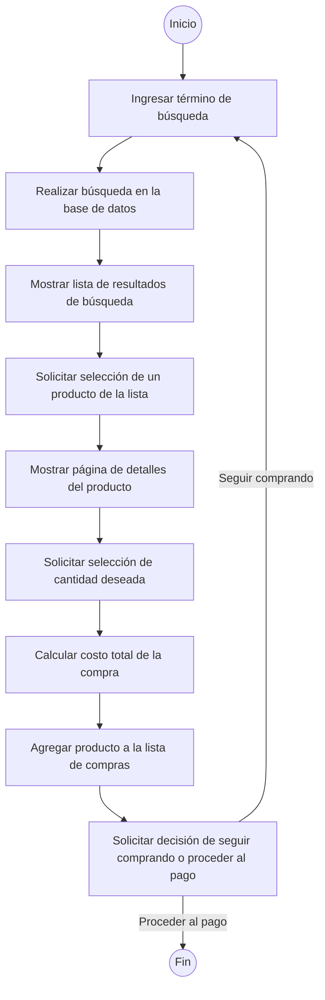

# Actividad Docucumentación Drogueria
# Descripción
Este es un ejemplo de documentación basica para un proyecto de una droguería online.

# Casos de uso

# Historia de usuario

# Diagrama de flujo

# Pseudocóigo
INICIO

Mostrar la barra de búsqueda de productos

Inicio

-> Abrir página web de la tienda en línea de la droguería

-> Mostrar barra de búsqueda de productos

-> Si el usuario ingresa un término de búsqueda:

-> Realizar búsqueda en la base de datos de productos utilizando el término ingresado

-> Mostrar lista de resultados de búsqueda que coincidan con el término ingresado, con detalles (nombre del producto, descripción, precio, cantidad disponible)

-> Si el usuario selecciona un resultado de búsqueda:

-> Mostrar la página del producto correspondiente, con detalles (nombre, descripción, precio, cantidad disponible, imagen)

-> Si el usuario desea realizar una compra:

->Seleccionar la cantidad deseada del producto

-> Calcular el costo total de la compra

-> Agregar el producto a la lista de compras

-> Continuar comprando o proceder al pago

-> Si no hay resultados de búsqueda:

-> Mostrar un mensaje indicando que no se encontraron resultados para el término de búsqueda ingresado

-> Si el usuario no ingresa un término de búsqueda:

-> Mostrar una lista de productos destacados o populares, con detalles (nombre del producto, descripción, precio, cantidad disponible, imagen)

-> Si el usuario selecciona un producto destacado o popular:

-> Mostrar la página del producto correspondiente, con detalles (nombre, descripción, precio, cantidad disponible, imagen)

-> Si el usuario desea realizar una compra:

-> Seleccionar la cantidad deseada del producto

-> Calcular el costo total de la compra

-> Agregar el producto a la lista de compras

-> Continuar comprando o proceder al pago

-> Cerrar página web de la tienda en línea de la droguería

FIN
